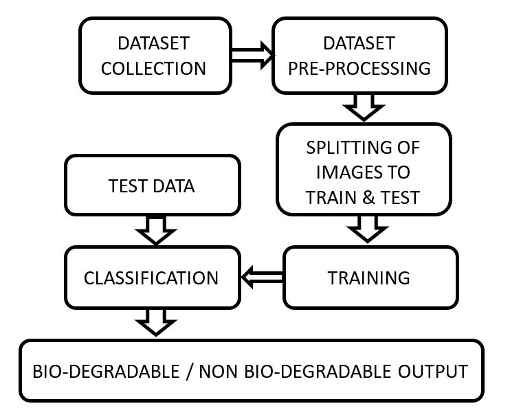

# Waste Management System - Biodegradable and Non-Biodegradable Classification

## Overview
This project focuses on developing a **Waste Management System** that classifies waste as either **Biodegradable** or **Non-Biodegradable** using **Machine Learning** techniques. The system uses a dataset of images to train a model that can accurately identify and categorize waste, helping in efficient waste management and environmental sustainability.

## Key Features
- **Image Classification**: The system classifies waste images into biodegradable and non-biodegradable categories.
- **Machine Learning Model**: Utilizes algorithms like Random Forest for accurate classification.
- **User Interface**: A user-friendly interface for uploading images and viewing classification results.
- **Dataset**: Contains images of biodegradable and non-biodegradable waste for training and testing the model.

## Components
1. **Dataset**:
   - Images of waste divided into **Biodegradable** and **Non-Biodegradable** categories.
   - Pre-processed and split into training and testing sets for model development.

2. **Machine Learning Model**:
   - Implemented using Python and scikit-learn libraries.
   - **Random Forest** classifier is used for robust and accurate classification.

3. **User Interface (UI)**:
   - Built with Python to allow easy image upload and display classification results.
   - Simple and interactive, enabling users to classify waste images in real-time.

## System Workflow

### Workflow Diagram
The following workflow illustrates the data flow from dataset preparation to final classification output.

1. **Dataset Collection**: Collect images of biodegradable and non-biodegradable waste.
2. **Pre-Processing**: Process the dataset for uniformity (resizing, normalization, etc.).
3. **Splitting of Images**: Split the dataset into training and test sets.
4. **Model Training**: Train the Random Forest model on the training data.
5. **Classification**: Use the trained model to classify new images.
6. **Output**: Display the classification result as biodegradable or non-biodegradable.

### Workflow Diagram


## Project Files
- **`rndmfrst_code.py`**: Contains the machine learning code to train and evaluate the Random Forest classifier.
- **`ui.py`**: Code for the User Interface that allows users to upload images and view the classification results.
- **`untitled1.py`**: Additional code file (specify functionality if necessary).
- **Dataset**: Folder containing images for training and testing (biodegradable and non-biodegradable).

## Setup and Usage

### Prerequisites
- **Python 3.x**: Ensure you have Python installed.
- **Required Libraries**:
  - `scikit-learn` for machine learning models.
  - `tkinter` or another UI library (if using `ui.py` for the interface).
  - `PIL` (Python Imaging Library) for image processing, if needed.

### Installation
1. **Clone the Repository**:
   ```bash
   git clone https://github.com/thejasaai-hub/Waste-Management-System.git
